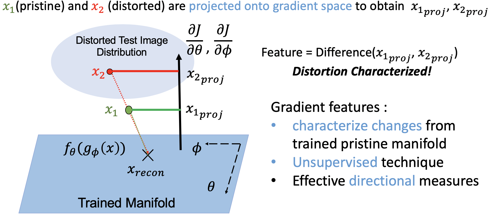
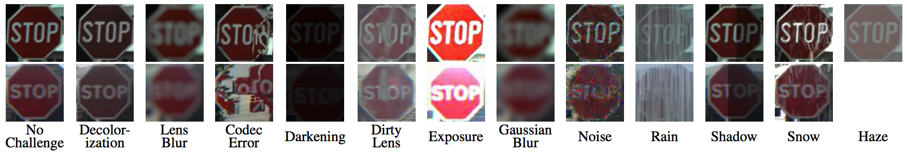
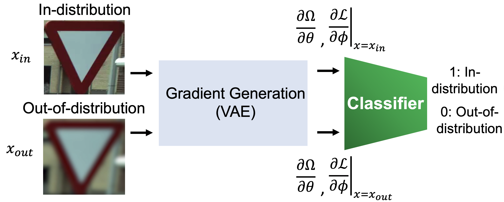

# Distorted Representation Space Characterization Through Backpropagated Gradients

This work is done in the [OLIVES @ Georgia Institute of Technology](http://www.ghassanalregib.info)

This repository includes the codes for the paper:

[Gukyeong Kwon*](https://www.linkedin.com/in/gukyeong-kwon/), [Mohit Prabhushankar*](https://www.linkedin.com/in/mohitps/), [Dogancan Temel](http://cantemel.com/), and [Ghassan AlRegib](http://www.ghassanalregib.info), "Distorted Representation Space Characterization Through Backpropagated Gradients", 2019 IEEE International Conference on Image Processing (ICIP), Taipei, Taiwan, 2019, pp. 2651-2655. (*: equal contribution) [[arXiv]](https://arxiv.org/abs/1908.09998) [[IEEE]](https://ieeexplore.ieee.org/abstract/document/8803228) [[Poster]](https://github.com/olivesgatech/distorted-representation-characteriziation/tree/master/poster)

This paper received ***Best Paper Award*** in ICIP 2019.

--------
## Abstract
In this paper, we utilize weight gradients from backpropagation to characterize the representation space learned by deep learning algorithms. We demonstrate the utility of such gradients in applications including perceptual image quality assessment and out-of-distribution classification. The applications are chosen to validate the effectiveness of gradients as features when the test image distribution is distorted from the train image distribution. In both applications, the proposed gradient based features outperform activation features. In image quality assessment, the proposed approach is compared with other state of the art approaches and is generally the top performing method on TID 2013 and MULTI-LIVE databases in terms of accuracy, consistency, linearity, and monotonic behavior. Finally, we analyze the effect of regularization on gradients using CURE-TSR dataset for out-of-distribution classification. 

<p align="center">

</p>

## Getting Started

### Requirements
- Tested on Linux 18.04, Python 3.6, PyTorch 1.1, CUDA 9.0.
- Tensorboard and [TensorboardX](https://github.com/lanpa/tensorboardX) to use tensorboard.


### Datasets

We utilize three large-scale image datasets, which are CURE-TSR, Multi-LIVE, and TID2013, to validate our proposed method. In particular, we use CURE-TSR dataset that includes more than 2M color traffic sign images with 14 traffic sign types under 5 levels of 12 different challenging conditions for for the out-of-distribution classification. To download CURE-TSR dataset, please visit [this repository](https://github.com/olivesgatech/CURE-TSR). 

<p align="center">

</p>

### Dataset Folder Structure

Folder Structure:
```
DATASET_PATH/
  cure-tsr/
    RealChallengeFree/
      train/
        01_01_00_00_00_05_0003.bmp
        01_01_00_00_00_05_0006.bmp
        01_01_00_00_00_05_0007.bmp
        ...
      val/
      test/
    RealChallenge/
      01_01/  # Challenge type 1 & level 1
        train/
          01_01_01_01_01_05_0003.bmp
          01_01_01_01_01_05_0006.bmp
          01_01_01_01_01_05_0007.bmp
        val/
        test/
      01_02/
      01_03/
      ...
      12_05/
```
## Code Usage
### Out-of-Distribution Classification

The out-of-distribution classification is performed by following five steps described below. Codes that correspond to each step is written in parenthesis. 

**Train:**
1) Train a variational autoencoder using challenge-free images in CURE-TSR. (Use `-we` flag to enable writing logs and checkpoints.) 
```
cd OOD
python train.py --dataset-dir='DATASET_PATH/cure-tsr/RealChallengeFree'
```
2) Extract backpropagated gradients from the trained VAE using challenge-free images and Gaussian blur images. By default, extracted gradients will be saved in the same folder as the dataset directory (e.g. DATASET_PATH/cure-tsr)
```
python extract_gradient_cure.py --dataset-dir='DATASET_PATH/cure-tsr/' --split='train' --loss-type='bce'
python extract_gradient_cure.py --dataset-dir='DATASET_PATH/cure-tsr/' --split='train' --loss-type='kld'
```
The expected outcomes from above codes are two folders (bce_grad, kld_grad) with the folder structure below:
```
DATASET_PATH/
  cure-tsr/
    bce_grad/
      CHECKPOINT_NAME/
        00_00_train_down_6.pt
        00_00_val_down_6.pt
        00_00_train_up_6.pt
        ...
    kld_grad/
```
3) Train a linear classifier using gradients from challenge-free images and Gaussian blur images. (Use `-we` flag to enable writing logs and checkpoints.) 
```
python train_ext_gradient.py --dataset-dir='DATASET_PATH/cure-tsr/'
```

**Test:**
1) Extract backpropagated gradients from the trained VAE using test images. 
```
python extract_gradient_cure.py --dataset-dir='DATASET_PATH/cure-tsr/' --split='test' --loss-type='bce'
python extract_gradient_cure.py --dataset-dir='DATASET_PATH/cure-tsr/' --split='test' --loss-type='kld'
```
2) Feed gradients from test images to the trained linear classifier.
```
python eval_ext_gradient.py --dataset-dir='DATASET_PATH/cure-tsr/'
```

<p align="center">
<br>

</p>

## Citation

If you have found our code and data useful, we kindly ask you to cite our work. 
```tex
@inproceedings{kwon2019distorted,
  title={Distorted Representation Space Characterization Through Backpropagated Gradients},
  author={Kwon, Gukyeong and Prabhushankar, Mohit and Temel, Dogancan and AlRegib, Ghassan},
  booktitle={2019 IEEE International Conference on Image Processing (ICIP)},
  pages={2651--2655},
  year={2019},
  organization={IEEE}
}
```
## Questions?

The code and data are provided as is with no guarantees. If you have any questions, regarding the dataset or the code, you can contact the authors (gukyeong.kwon@gatech.edu or mohit.p@gatech.edu), or even better open an issue in this repo and we'll do our best to help.

